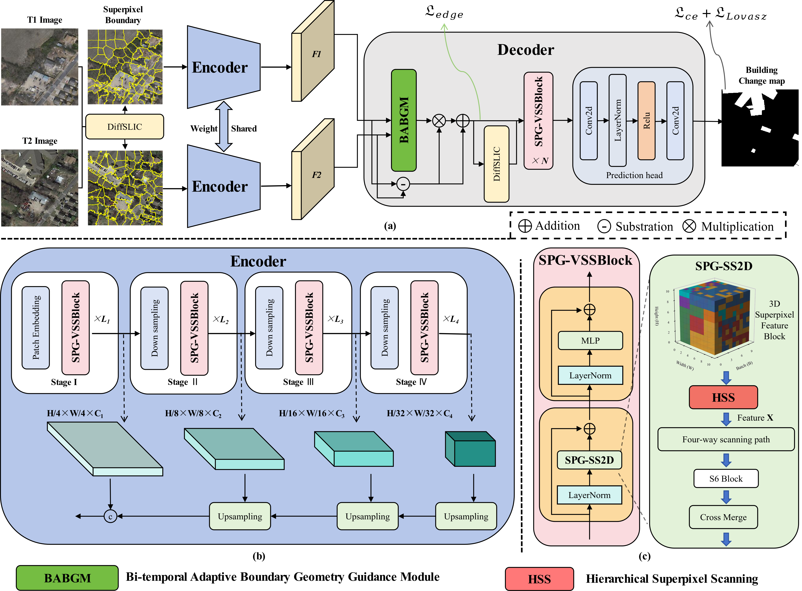
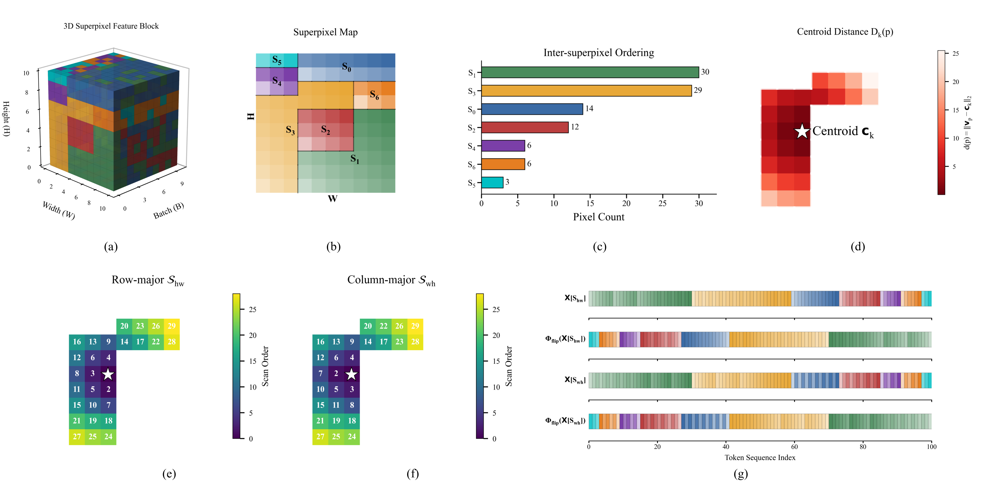
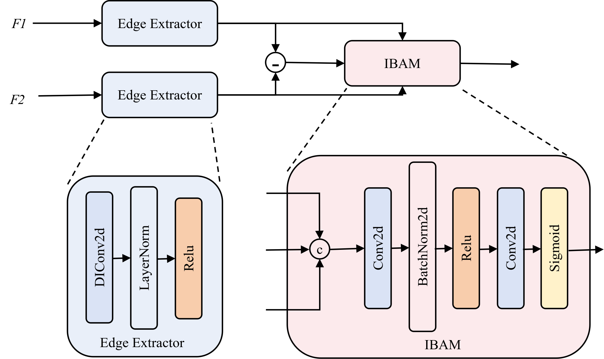

# SPGMamba-CD: Superpixel-Guided Remote Sensing Building Change Detection with Mamba Network

SPGMamba-CD is a Mamba-based building change detection (BCD) method designed for high-resolution remote sensing imagery. Its encoder adopts a four-stage architecture to characterize multi-scale building change information, while the superpixel-guided VSSBlock (SPG-VSSBlock) is used as the fundamental module to adaptively extract both global and local features. SPG-VSSBlock leverages superpixel spatial priors and a Hierarchical Superpixel Scanning (HSS) strategy to maintain spatial-semantic continuity and dynamically align discriminative pixels with Mamba memory states. In the decoder, a Bi-temporal Adaptive Boundary Geometry Guidance Module (BABGM) is introduced to alleviate shadow-induced boundary ambiguity and enhance boundary representation.

## Overview

*Figure 1: Overall architecture of the proposed SPGMamba-CD framework.*

## Method Highlights

The key components of the proposed method are illustrated below.

*Figure 2: Illustration of the Hierarchical Superpixel Scanning (HSS) strategy.*

*Figure 3: Illustration of the Bi-temporal Adaptive Boundary Geometry Guidance Module (BABGM).*

## Datasets

The proposed method is evaluated on the following five public change detection datasets.

**1. GZ-CD** ([link](https://github.com/daifeng2016/Change-Detection-Dataset-for-High-Resolution-Satellite-Imagery))

GZ-CD contains bi-temporal GF-2 satellite images of Guangzhou, China, acquired between 2006 and 2019, with a spatial resolution of approximately 0.5 m. The original dataset consists of 19 image pairs with varying sizes. Following the common preprocessing protocol, the images are cropped into non-overlapping patches of 256 x 256 pixels, yielding 3130 image pairs that are divided into training, validation, and test sets with a ratio of 7:1:2. Owing to its multispectral characteristics and dense urban scenes, GZ-CD provides a challenging benchmark for evaluating robustness against illumination variations, sensor differences, and pseudo-changes caused by complex building distributions.

**2. LEVIR-CD** ([link](https://justchenhao.github.io/LEVIR/))

LEVIR-CD consists of 637 pairs of bi-temporal aerial images with a spatial resolution of 0.5 m and an image size of 1024 x 1024 pixels. Following the official data split, each image is cropped into non-overlapping patches of 256 x 256 pixels, resulting in 7120 training, 1024 validation, and 2048 test samples. This dataset mainly evaluates the capability of accurately detecting building changes under diverse urban environments.

**3. LEVIR-CD+** ([link](https://github.com/S2Looking/Dataset/tree/main/LEVIR-CD%2B/LEVIR-CD%2B))

LEVIR-CD+ extends LEVIR-CD by providing 985 pairs of Google Earth images with a temporal interval ranging from 5 to 15 years and a spatial resolution of 0.5 m. Each image pair has a size of 1024 x 1024 pixels. Following the protocol in [50], the images are cropped into non-overlapping 256 x 256 patches, producing 10,192 training samples and 5568 test samples. The dataset poses additional challenges due to significant illumination variations, seasonal differences, and fine-grained building boundaries.

**4. WHU-CD** ([link](http://study.rsgis.whu.edu.cn/pages/download/building_dataset.html))

WHU-CD is collected from aerial images of Christchurch, New Zealand, and captures building changes before and after the 2011 earthquake. It consists of a pair of orthophotos with a spatial resolution of 0.2 m. Following [20], the images are cropped into 256 x 256 patches, with 10% of the training samples used for validation, resulting in 4536 training, 504 validation, and 2760 test samples. Benefiting from its ultra-high spatial resolution and complex post-disaster scenes, WHU-CD is particularly suitable for evaluating boundary localization accuracy and robustness against background interference.

**5. UAV-CD+** ([link](https://github.com/yikuizhai/UCSFH-Net))

UAV-CD+ consists of 2002 pairs of bi-temporal low-altitude UAV images collected in a prefecture-level city in Guangdong Province, China. Each image has a spatial resolution of 0.06 m and an image size of 1024 × 1024 pixels, with a two-year temporal interval between the two acquisitions. The dataset is divided into training, validation, and test sets at a ratio of 8:1:1. Following the original protocol, the images are further cropped into 256 × 256 patches to facilitate model training and deployment on resource-constrained devices. Unlike conventional change detection datasets that primarily focus on urban building changes, UAV-CD+ covers diverse change categories, including urban architectural changes, large-scale construction sites, land-use changes, and water-area changes. Benefiting from its ultra-high spatial resolution and low-altitude UAV imagery, UAV-CD+ provides a challenging benchmark for evaluating the capability of change detection methods to identify subtle and small-scale changes, as well as their generalization across diverse real-world change scenarios.

## License

The code is released for academic research only. The datasets follow their respective licenses from the original providers.
